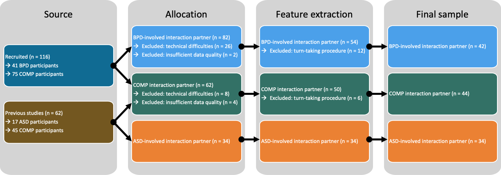

```{r setup, include=FALSE}

# clear global environment
rm(list=ls())

knitr::opts_chunk$set(echo = F, fig.pos = "center",
                      fig.width = 7.5, fig.height = 4,
                      out.width = "7.5in")

# load libraries
ls.packages = c("tidyverse",        # tibble stuff
                "knitr",            # kable
                "ggpubr",           # ggarrange
                "ggrain",           # geom_rain
                "Hmisc",
                "rstatix",          # shapiro_test
                "emmeans",          # group comparisons for anovas
                "flextable",        # regulartable
                "officer",          # read_docx
                "kableExtra",       # more kable settings
                "english"           # numbers to words
                )
lapply(ls.packages, library, character.only=TRUE)

# set colour schemes
custom.col4 = c("#004D40", "#1E88E5", "#FFC107", "#D81B60", "#5D3A9B", "#E66100")

# set flextable defaults
#set_flextable_defaults(
#  font.family = "Helvetica", font.size = 9, 
#  border.color = "gray", big.mark = "")

# set figure directory
svm.dir = "./SVM_classifier"
fig.dir = file.path(svm.dir, "figures")

# function to change small numbers
int2words = function(x) {
  if (x <= 12) {
    x = as.english(x)
  }
  as.character(x)
} 

# load the data 
load("BOKI_supps.RData")

```

```{r lib_versions}

print(R.Version()$version.string)

for (package in ls.packages) {
  print(sprintf("%s version %s", package, packageVersion(package)))
}
```

# Inclusion and exclusion criteria 

Inclusion criteria applying to all participants: 

* no neurological diagnoses
* at least 18 and at most 60 years of age
* normal or corrected-to-normal vision
* legally binding, written informed consent from the participant for study participation

We only included clinical participants with either a BPD or an ASD diagnosis but excluded anyone who was given both diagnoses.

Additional inclusion criteria for ASD participants: 

* valid F84 diagnosis according to ICD-10
* normal speaking abilities

Additional inclusion criteria for BPD participants: 

* valid F60.31 diagnosis according to ICD-10
* no F84 diagnosis according to ICD-10
* IQ estimate above 70

Additional inclusion criteria for comparison participants: 

* IQ estimate above 70
* no psychiatric diagnoses
* no current psychotropic medication

Furthermore, we applied the following exclusion criteria: 

* underage people or people older than 60 years
* inability to speak
* current or previous neurological disorder
* acute suicidality, self-harming or aggressive behaviour
* lack of legally binding informed consent

Testing was discontinued if participants withdrew their consent, exclusion criteria applied or in the case of technical difficulties. 

## Consort chart

Consort chart detailing the source of the data, exclusion of data and sample sizes for each interaction context. We reused data of ASD and comparison participants without psychiatric diagnoses (COMP) from two previous studies [@koehler_machine_2024; @plank2023automated]. The data of all participants that were included in the analyses of both of these studies was included. Additionally, we recruited BPD and COMP participants. In a first step, we allocated participants to BPD-involved or COMP dyads based on their availability. Data of dyads where audio or video data of at least one interaction partner was missing was excluded. Due to a technical failure of our audio recording setup which had to be replaced, these numbers are substantial for the BPD-involved interaction contexts. Furthermore, we visually and aurally inspected the data and excluded data from dyads with insufficient data quality, for example, if a microphone picked up both interaction partners. After using the uhm-o-meter [@de_jong_praat_2021; @de_jong_uhm-o-meter_2021] to distinguish between each interaction partner speaking and being silent, we visually inspected the results and excluded data from all dyads where speaking turns were not correctly identified. 

```{r}

```

# Procedures

The hobbies prompt was chosen to capture monologuing by ASD adults when talking about their interests [@nadig_how_2010], while the mealplanning conversation required increased turn-taking and collaboration from both participants [@Tschacher2014]. The order of the conversations was counterbalanced across participants and the experimenter left the room during the conversations. After both conversations were finished, they filled out a custom rapport questionnaire.

All conversations took place in stable artificial light to control for any biases caused by lighting changes [@ramseyer_motion_2020]. Since some of the data was collected during the COVID-19 pandemic, we modified the setup to maximise the safety of our participants, for instance by placing a plexiglass between them. Furthermore, participants filled out several questionnaires to capture subjective clinical self-ratings, completed two intelligence assessments which were combined for the IQ estimate and performed the Berlin Emotion Recognition Test (BERT) [@drimalla_berlin_2019]. 

Audio and video streams were time-locked by aligning them based on the sound and visual of a movie clap denoting the start of the task. Videos and audio tracks were cut to 10min length using DaVinci Resolve.

# Measures

We collected the following self-report questionnaires: 

* Autism-like traits: Autism Quotient, AQ [@baron-cohen_autism-spectrum_2001]
* Empathy: Saarbrücker Persönlichkeitsfragebogen, SPF [@Paulus2009], which is the German version of the interpersonal reactivity index
* Alexithymia: Toronto Alexithymia Scale, TAS20 [@Popp2008]
* Depressiveness: Beck Depression Inventory, BDI [@hautzinger_beck-depressions-inventar_1994]
* Self-monitoring: Self-monitoring Scale, SMS [@graf_german_2004]
* Movement difficulties: Adult Dyspraxia Checklist, ADC [@kirby_development_2010]

For all participants recruited for this project, we also collected the short version of the Borderline Symptom List, BSL-23 [@bohus_short_2008].

For 37 of the dyads, we used a plexiglass screen placed between the interaction partners on the table to decrease the chances of spreading an undetected infection. We applied a transparent anti-reflection foil to reduce any mirroring effects. During the conversation, participants took off their face masks. We asked these participants how much the plexiglass influenced them during the interactions (plexi; scale from 0 to 3). All participants were asked how much the cameras influenced their behaviour (video; scale from 0 to 3). Rapport is a sum of the following ratings, all on scales from 0 to 3, thus ranging from 0 to 15: 

* How likeable was your interaction partner? 
* How friendly was your interaction partner? 
* How comfortable did you feel during the conversation?
* How smooth was the communication between you and your conversation partner?
* How well did your conversation partner respond to you?

## Medication and clinical presentation

Of our clinical participants, 69.2% were taking psychotropic medication, most commonly antidepressants (ASD: 41.2%; BPD: 72.7%), antipsychotics (ASD: 11.8%; BPD: 40.9%), anticonvulsants (ASD: 5.9%; BPD: 22.7%) or a combination thereof. Thus, our sample seems clinically realistic in its heterogeneity of medication intake [@leichsenring_borderline_2024;@leichsenring_borderline_2023;@hirota_autism_2023]. We used the Autism Quotient (AQ) [@baron-cohen_autism-spectrum_2001] and the Borderline Symptom List 23 (BSL-23) [@bohus_short_2008] to further characterise our clinical samples. In our ASD sample, the AQ values were on average 34.3 ± 6.2 points, with 64.7% autistic adults scoring above the threshold of 32 points [@baron-cohen_autism-spectrum_2001]. In our BPD sample, 9.5% showed extremely high, 9.5% very high, 38.1% high, 23.8% moderate and 19% mild symptoms according to the BSL-23 [@kleindienst_proposed_2020].

##  Group comparisons based on diagnostic status

Participants did not differ in age (ASD: x̄ = 37.59 ± 13.19; BPD: x̄ = 28.38 ± 10.02; COMP: x̄ = 28.89 ± 10.18; BPD vs. ASD: pFDR = 0.506; ASD vs. COMP: pFDR = 0.243; BPD vs. COMP: pFDR = 1), IQ estimate (ASD: x̄ = 116.47 ± 13.90; BPD: x̄ = 109.60 ± 9.54; COMP: x̄ = 112.77 ± 13.26; each pFDR = 1), but there was a trend for a difference in gender distribution (ASD: 6 female, 11 male; BPD: 14 female, 7 male; COMP: 52 female, 30 male; p = 0.078). However, our exploration of the influence of gender on decision scores in our support vector machines revealed no difference. Testing duration was two to three and a half hours.

```{r demo1}

df.sub = df.lng %>%
    filter(is.na(task)) %>%
    mutate_if(is.character, as.factor) %>%
    select(-task)

# loop through the questionnaires etc
df.demo = data.frame()
feats = unique(df.sub$feature)

for (f in feats) {
  
  df.sel  = df.sub %>% filter(feature == f) %>% drop_na()
  df.sel2 = df.sub %>% filter(feature == f) %>% drop_na()
  
  # check which outcomes of interest are normally distributed
  df.sht = df.sel %>% 
    group_by(ilabel) %>%
    shapiro_test(value) %>%
    filter(p < 0.05)
  
  # if at least one is not normally distributed, then rank transform > turns into Kruskal-Wallis-test
  if (nrow(df.sht) > 0) {
    df.sel = df.sel %>%
      ungroup %>%
      mutate(
        value = rank(value)
      )
  }
  
  # compute the anova between groups
  aov.out  = aov(value ~ ilabel, data = as.data.frame(df.sel))
  
  # check whether this is the BSL > not collected in original ASD sample
  if (f != "BSL_total") {
    # perform group comparisons
    aov.pair = TukeyHSD(aov.out)
    
    # get the p-values
    BPDvASD  = aov.pair$ilabel["BPD-ASD",4]
    COMPvASD = aov.pair$ilabel["COMP-ASD",4]
    COMPvBPD = aov.pair$ilabel["COMP-BPD",4]
  
  } else {
    # get the results
    aov.res = summary(aov.out)
    
    # get the p-values
    BPDvASD  = NA
    COMPvASD = NA
    COMPvBPD = aov.res[[1]][["Pr(>F)"]][1]
    
  }
  
  # put all the information in df.demo
  df.demo = rbind(df.demo, 
                  data.frame(
                    measurement = f,
                    ASD         = sprintf("%.2f (±%.2f), n = %.0f", 
                                          mean(df.sel2[df.sel2$ilabel == "ASD",]$value), 
                                          sd(df.sel2[df.sel2$ilabel == "ASD",]$value),
                                          sum(df.sel2$ilabel == "ASD")
                    ),
                    BPD         = sprintf("%.2f (±%.2f), n = %.0f", 
                                          mean(df.sel2[df.sel2$ilabel == "BPD",]$value), 
                                          sd(df.sel2[df.sel2$ilabel == "BPD",]$value),
                                          sum(df.sel2$ilabel == "BPD")
                    ),
                    COMP        = sprintf("%.2f (±%.2f), n = %.0f", 
                                          mean(df.sel2[df.sel2$ilabel == "COMP",]$value), 
                                          sd(df.sel2[df.sel2$ilabel == "COMP",]$value),
                                          sum(df.sel2$ilabel == "COMP")
                    ),
                    `BPDvsASD`   = BPDvASD,
                    `COMPvsASD`  = COMPvASD,
                    `COMPvsBPD`  = COMPvBPD
                  ))
  
}


kbl(df.demo %>%
        mutate(
          # perform fdr correction
          `BPDvsASD`  = p.adjust(`BPDvsASD`,  method = "BY", n = length(feats)),
          `COMPvsASD` = p.adjust(`COMPvsASD`, method = "BY", n = length(feats)),
          `COMPvsBPD` = p.adjust(`COMPvsBPD`, method = "BY", n = length(feats)),
          # add asterisk if significant
          `BPDvsASD`  = if_else(`BPDvsASD` < 0.05, 
                               sprintf("%.3f*",`BPDvsASD`),
                               sprintf("%.3f", `BPDvsASD`)),
          # add asterisk if significant
          `COMPvsASD`  = if_else(`COMPvsASD` < 0.05, 
                               sprintf("%.3f*",`COMPvsASD`),
                               sprintf("%.3f", `COMPvsASD`)),
          # add asterisk if significant
          `COMPvsBPD`  = if_else(`COMPvsBPD` < 0.05, 
                               sprintf("%.3f*",`COMPvsBPD`),
                               sprintf("%.3f", `COMPvsBPD`)),
        ) %>% 
          rename('BPD vs. ASD' = 'BPDvsASD',
                 'COMP vs. ASD' = 'COMPvsASD',
                 'COMP vs. BPD' = 'COMPvsBPD') %>%
          arrange(measurement), caption = "Group comparisons",
      booktabs = T, linesep = '') %>%
  kable_styling(font_size = 9)  %>%
  column_spec(1, width = "0.75in") %>%
  column_spec(2, width = "1.4in") %>%
  column_spec(3, width = "1.4in") %>%
  column_spec(4, width = "1.4in") %>%
  column_spec(5, width = "0.5in") %>%
  column_spec(6, width = "0.5in") %>%
  column_spec(7, width = "0.5in")
  
  

```


```{r gender1}

# get gender frequencies and compare them across groups
df.gen = df.sub %>% select(ID, gender, ilabel) %>% distinct()
tb.gen = xtabs(~ gender + ilabel, data = df.gen)
ct.gen = chisq.test(tb.gen)

tb.gen

ct.gen

```

#  Features 

We extracted head position (each three translational and three rotational parameters) and facial expressions as the strength of the activation of action units using OpenFace 2.0 [@baltrusaitis_openface_2018]. We used Motion Energy Analysis (MEA) to capture motion quantity for head and body regions from the scene camera [@ramseyer_motion_2020]. Audio data was analysed using a custom processing pipeline in praat [@praat] which incorporated the uhm-o-meter by De Jong and colleagues [@de_jong_praat_2021; @de_jong_uhm-o-meter_2021]. This pipeline extracted individual phonetic and turn-taking features. Furthermore, we computed synchrony measures using windowed cross-lagged correlations as implemented in the rMEA package [@kleinbub_rmea_2021]. 

##  Facial expressions extracted from OpenFace

We only included data of participants with a mean confidence of tracked frames greater than 75% and more than 90% successfully tracked frames. Facial expressions were captured as action units. We did not extract emotional expressions from these facial expressions as coherence between facial expressions and emotions is not a given and might be even less so for autistic people [@costa_expressive_2017]. 

For the calculation of synchronisation, we included rotational parameters (yaw, roll, pitch) as well as the same action units as in our previous study [@koehler_machine_2024]: 

* Mealplanning: 1, 2, 6, 7, 9, 14, 15, 17, 20, 25, 26 and 45 
* Hobbies: 1, 2, 6, 7, 9, 15, 17, 20, 23, 25, 26 and 45

We also extracted total facial expressiveness as mean intensity of all action units for each interaction partner to be included in the *MovEx* and the *CROSSturn* models. For the *CROSSturn* model, we also included other action units, as listed below. 

These correspond to the following movements: 

* AU1: inner brow raiser
* AU2: outer brow raiser
* AU4: brow lowerer (only *CROSSturn*)
* AU5: upper lid raiser (only *CROSSturn*)
* AU6: cheek raiser
* AU7: lid tightener
* AU9: nose wrinkler
* AU10: upper lip raiser (only *CROSSturn*)
* AU12: lip corner puller (only *CROSSturn*)
* AU14: dimpler
* AU15: lip corner depressor
* AU17: chin raiser
* AU20: lip stretcher
* AU23: lip tightener
* AU25: lips part
* AU26: jaw drop
* AU45: blink

Furthermore, we used translational head position parameters to infer head motion using the following formula with $\Delta_t$ referring to the respective frame-to-frame changes:

$$\text{head movement} = \sqrt{\Delta_t x^2 + \Delta_t y^2 + \Delta_t z^2}$$


##  Motion quantity extracted using Motion Energy Analysis

This figure shows body (red and purple) and head (yellow and orange) regions of interests of each interaction partner separately:

```{r}
knitr::include_graphics(file.path(fig.dir, "MEA_ROIs-v2.png"))
```

There was always a space between the head and body region. Regions were chosen such that they cover the full range of motion throughout one conversation of one interaction partner. Thus, their sizes differed which is why we scaled all values. 

In addition to using the motion quantity to compute synchronisation, we also extracted total movement in each region of interest for each interaction partner to be included in the *MovEx* model. 

##  Speech and turn-taking features

We extracted pitch using praat's autocorrelation method, a technique widely recognized for its reliability and accuracy [@praat]. We implemented a two-step pitch extraction method, as outlined by Hirst [@hirst_analysis_2011]. First, to capture a broad range of frequencies, we set a low pitch floor of 50 Hz and a high pitch ceiling of 700 Hz, with a time step of 15 ms. All other parameters were set to Praat's default values. Second, using these initial pitch values, we determined the first and third quartiles of pitch for each participant and task. We then used these quartiles to compute individual pitch floors and ceilings with the following algorithm:

$$\text{floor} = \min\left( 0.75 \cdot Q_{1, hobbies}, 0.75 \cdot Q_{1, mealplanning}\right)$$

$$\text{ceiling} = \max\left( 2.5 \cdot Q_{3, hobbies}, 2.5 \cdot Q_{3, mealplanning}\right)$$

We then used these individual pitch floors (range = `r min(df.limits$floor_pp)` to `r max(df.limits$floor_pp)`Hz, mean = `r round(mean(df.limits$floor_pp),1)` ± `r round(sd(df.limits$floor_pp),1)`) and ceilings (range = `r min(df.limits$ceiling_pp)` to `r max(df.limits$ceiling_pp)`Hz, mean = `r round(mean(df.limits$ceiling_pp),1)` ± `r round(sd(df.limits$ceiling_pp),1)`) to extract pitch. To ensure an equal number of frames for all participants, we maintained a consistent time step across all analyses. By default, praat calculates this time step using the following formula:

$$\text{timestep} = \frac{0.75}{\text{floor}}$$

Here, we used the same time step of 0.016 as in our previous study [@plank2023automated] which was determined based on the minimum individual pitch floor of that sample. Since the new sample did not include anyone with a lower pitch floor, the time step fits both samples. 

Intensity was extracted by convolving the squared sound with a Gaussian analysis window. We used praat's default values of minimum pitch 100Hz and time step of 0.01s. 

To estimate synchrony, we extracted continuous pitch and intensity time series for every millisecond of the recording. For pitch extraction, we used consistent parameters across all participants instead of individualized settings. This was necessary because the analysis width depends on the pitch floor. Given the heterogeneity of our sample, we opted for a wide range of considered frequencies, setting the pitch floor at 50Hz and the pitch ceiling at 700Hz. For intensity, we relied on Praat's default values.

In the case of turn-based synchronization, we correlated the median pitch or intensity of each turn with the median pitch or intensity of the preceding turn.

Next, we used the uhm-o-meter [@de_jong_uhm-o-meter_2021; @de_jong_praat_2021] to differentiate between periods of speaking and silence, identify syllables and extract several prosodic features (total number of syllables, total number of silent phases, duration of speaking as phonation time, speech rate as number of syllables per second, articulation rate as number of syllables per phonation time, average syllable duration and silence-to-turn ratio). The resulting speaking and silent instances were visually and aurally inspected to verify the accuracy of the algorithm.  

##  Cross-modal features

We captured two types of cross-modal features: 

* Interpersonal synchronisation of one person's head with the other person's body movement and vice versa
* AU activation, body and head movement during listening and speaking

##  Synchrony computations

We used the following settings for our windowed lagged cross-correlation (WLCC): For lag, step and window size, we stayed in line with previous literature [@koehler_machine_2024,@plank_automated_2023,@ochi_quantification_2019,@schoenherr_identification_2019,@zampella_computer_2020]. We applied Fisher’s Z-transformation and converted all values to their absolute [@zadok_shifts_2022]. Furthermore, we computed turn-based adaptation of pitch and intensity.  

```{r sync_table}

measure = c("Facial action units synchronisation", "Body MEA synchronisation", 
            "Head MEA synchronisation", "Intrapersonal synchrony", 
            "Pitch synchrony", "Intensity synchrony")

window = c(7, 30, 30, 30, 16, 16)
step   = c(4, 15, 15, 15,  8,  8)
lag    = c(2,  5,  5,  5,  2,  2)

kbl(data.frame(measure, window, step, lag), caption = "WLCC settings in seconds",
      booktabs = T, linesep = '', longtable = T) %>%
  kable_styling(font_size = 9) 

```

For each window, the maximum correlation value was chosen out of all relevant lags (peack-picking). We cross-correlated head movements (from OpenFace) with body motion energy time series (from MEA) to estimate intrapersonal synchrony. 

##  Feature lists 

This list shows all features without the information of conversation, i.e., each of these features was added twice to the model, once from the mealplanning and once from the hobbies conversation. The number of features per model is displayed as well. For many of the extracted features, we calculated summary scores some which are indicated by abbreviations (mean, md = median, sd = standard deviation, min = minimum, max = maximum, ske = skewness and kurtosis)

```{r feats}

# add the model to the feature list
df.feat.m = df.lng %>%
  filter(task == "mealplanning") %>%
  mutate(
    model = case_when(
      grepl("_AU", feature) & !grepl("self|other", feature) ~ "FACEsync",
      grepl("headsync|Rx|Ry|Rz", feature) ~ "HEADsync",
      grepl("bodysync", feature) ~ "BODYsync",
      grepl("intra", feature) ~ "INTRAsync",
      grepl("movement|intensity", feature) ~ "MovEx",
      grepl("speech", feature) ~ "Speech",
      grepl("self_|other_", feature) ~ "CROSSturn",
      grepl("_LOF|_ROF", feature) ~ "CROSSsync"
    )
  ) %>%
  select(model, feature) %>% distinct() %>%
  group_by(model) %>%
  summarise(
    features = paste(feature, collapse = ", "),
    x = n() * 2
  ) %>%
  mutate(
    model = paste0(model, sprintf(' (%d features)', x))
  ) %>% select(-x)

kbl(df.feat.m, booktabs = T, linesep = "\\addlinespace", longtable = T,
    caption = "List of all mealplanning features of the base models") %>%
  kable_styling(font_size = 8) %>%
  column_spec(1, width = "1in", bold = T) %>%
  column_spec(2, width = "6in")

```

#  Model performance

## Distinguishing ASD-involved from comparison interactions

All base models except the *HEADsync* and the *INTRAsync* models performed significantly better than chance according to permutation tests  (*HEADsync*: *p~FDR~* = `r round(df.nm[df.nm$model == "HEADsync" & df.nm$comparison == "ASD-COMP vs COMP-COMP",]$"p.fdr",3)`; *INTRAsync*: *p~FDR~* = `r round(df.nm[df.nm$model == "INTRAsync" & df.nm$comparison == "ASD-COMP vs COMP-COMP",]$"p.fdr",3)`). For this comparison, the *FACEsync* model achieved the highest balanced accuracy, specifically `r round(df.t[df.t$comparison == "ASD-COMP vs COMP-COMP" & df.t$model == "FACEsync",]$BAC,1)`% (`r round(df.t[df.t$comparison == "ASD-COMP vs COMP-COMP" & df.t$model == "FACEsync",]$sens,1)`% sensitivity; `r round(df.t[df.t$comparison == "ASD-COMP vs COMP-COMP" & df.t$model == "FACEsync",]$spec,1)`% specificity), closely followed by the *CROSSsync* model with `r round(df.t[df.t$comparison == "ASD-COMP vs COMP-COMP" & df.t$model == "CROSSsync",]$BAC,1)`% balanced accuracy (`r round(df.t[df.t$comparison == "ASD-COMP vs COMP-COMP" & df.t$model == "CROSSsync",]$sens,1)`% sensitivity; `r round(df.t[df.t$comparison == "ASD-COMP vs COMP-COMP" & df.t$model == "CROSSsync",]$spec,1)`% specificity). The stacking model had a significantly higher balanced accuracy of `r round(df.t[df.t$comparison == "ASD-COMP vs COMP-COMP" & df.t$model == "STACK",]$BAC,1)`% (`r round(df.t[df.t$comparison == "ASD-COMP vs COMP-COMP" & df.t$model == "STACK",]$sens,1)`% sensitivity; `r round(df.t[df.t$comparison == "ASD-COMP vs COMP-COMP" & df.t$model == "STACK",]$spec,1)`% specificity). Here, `r int2words(sum(df.pred3$group == "ASD-involved, misclassified"))` ASD-involved interactions were misclassified as non-clinical, while `r int2words(sum(df.pred3$group == "non-clinical, misclassified"))` non-clinical interactions were mistaken as ASD-involved interactions. The rest of the interaction partners, `r int2words(sum(df.pred3$Errors != "misclassified"))` in total, were classified accurately. The stacking did not perform significantly better than the best base model (*FACEsync*: *p~FDR~* = `r round(df.comp3[df.comp3$Row == "FACEsync_Cl3",]$STACK_Cl3, 3)`) but outperformed all other base models.

## Distinguishing BPD-involved from COMP interactions

While developing an algorithm for technology-assisted diagnostics of BPD was not the explicit goal of this research project, we explored the application of our features to the classification between BPD-involved and COMP interactions. Despite the features being chosen with symptoms and characteristics of ASD in mind, the *CROSSturn*, *FACEsync*, *HEADsync* and *Speech* models performed above chance in this comparison (*BODYsync*: *p~FDR~* = `r round(df.nm[df.nm$model == "BODYsync" & df.nm$comparison == "BPD-COMP vs COMP-COMP",]$"p.fdr",3)`; *CROSSsync*: *p~FDR~* = `r round(df.nm[df.nm$model == "CROSSsync" & df.nm$comparison == "BPD-COMP vs COMP-COMP",]$"p.fdr",3)`; *INTRAsync*: *p~FDR~* = `r round(df.nm[df.nm$model == "INTRAsync" & df.nm$comparison == "BPD-COMP vs COMP-COMP",]$"p.fdr",3)`; *MovEx*: *p~FDR~* = `r round(df.nm[df.nm$model == "MovEx" & df.nm$comparison == "BPD-COMP vs COMP-COMP",]$"p.fdr",3)`). Specifically, the *HEADsync* model achieved `r round(df.t[df.t$comparison == "BPD-COMP vs COMP-COMP" & df.t$model == "HEADsync",]$BAC,1)`% balanced accuracy (`r round(df.t[df.t$comparison == "BPD-COMP vs COMP-COMP" & df.t$model == "HEADsync",]$sens,1)`; `r round(df.t[df.t$comparison == "BPD-COMP vs COMP-COMP" & df.t$model == "HEADsync",]$spec,1)`% specificity), the *FACEsync* `r round(df.t[df.t$comparison == "BPD-COMP vs COMP-COMP" & df.t$model == "FACEsync",]$BAC,1)`% (`r round(df.t[df.t$comparison == "BPD-COMP vs COMP-COMP" & df.t$model == "FACEsync",]$sens,1)`; `r round(df.t[df.t$comparison == "BPD-COMP vs COMP-COMP" & df.t$model == "HEADsync",]$spec,1)`% specificity), the *Speech* `r round(df.t[df.t$comparison == "BPD-COMP vs COMP-COMP" & df.t$model == "Speech",]$BAC,1)`% (`r round(df.t[df.t$comparison == "BPD-COMP vs COMP-COMP" & df.t$model == "Speech",]$sens,1)`; `r round(df.t[df.t$comparison == "BPD-COMP vs COMP-COMP" & df.t$model == "Speech",]$spec,1)`% specificity) and the *CROSSturn* `r round(df.t[df.t$comparison == "BPD-COMP vs COMP-COMP" & df.t$model == "CROSSturn",]$BAC,1)`% (`r round(df.t[df.t$comparison == "BPD-COMP vs COMP-COMP" & df.t$model == "CROSSturn",]$sens,1)`; `r round(df.t[df.t$comparison == "BPD-COMP vs COMP-COMP" & df.t$model == "CROSSturn",]$spec,1)`% specificity). The stacking model performed comparable to the *HEADsync* and the *MovEx* model but outperformed the other base models, reaching `r round(df.t[df.t$comparison == "BPD-COMP vs COMP-COMP" & df.t$model == "STACK",]$BAC,1)`% balanced accuracy (`r round(df.t[df.t$comparison == "BPD-COMP vs COMP-COMP" & df.t$model == "STACK",]$sens,1)`; `r round(df.t[df.t$comparison == "BPD-COMP vs COMP-COMP" & df.t$model == "STACK",]$spec,1)`% specificity). Thus, the stacking model only misclassified `r int2words(sum(df.pred2$group == "BPD-involved, misclassified"))` BPD-involved interactions as COMP, but `r int2words(sum(df.pred2$group == "COMP, misclassified"))` COMP interactions were labelled as BPD-involved. 

##  One-verus-One comparisons

```{r tbl_ovo}

kbl(
  merge(
    df.t %>% select(comparison, model, sens, spec, BAC, AUC),
    df.nm %>% select(comparison, model, "p.fdr")
    ) %>%
    mutate(
      sig = if_else(`p.fdr` < 0.05, "*", "")
    ),
  digits = 3, booktabs = T, longtable = T, linesep = "",
    caption = "Performance of all the models in One-versus-One comparisons") %>%
  kable_styling(font_size = 9) 

```

##  Multi-group comparisons

```{r tbl_multi}

kable(
  df.nm %>% select(comparison, model, BAC, "p.fdr") %>% 
    filter(comparison == "MultiGroup") %>%
    mutate(
      sig = if_else(p.fdr < 0.05, "*", "")
    ),
  digits = 3, booktabs = T, longtable = T, linesep = "",
    caption = "Performance of all the models in Multi-group comparisons") %>%
  kable_styling(font_size = 9) 

```

##  Gender comparisons

Did the models perform better for one gender than the other? We perform unpaired Wilcoxon tests for the labels and models separately. 

```{r aov_gen, fig.height=4, fig.width=9}

# add gender to the prediction table
df.sub.gen1 = merge(
  df.lng %>% select(ID, label, gender) %>% distinct() %>% 
    filter(label != "COMP") %>% mutate(Cases = row_number()), 
  df.pred1) %>% 
  mutate(
    comp = "ASD- vs. BPD-inv"
  ) %>% mutate_if(is.character, as.factor)
df.sub.gen2 = merge(
  df.lng %>% select(ID, label, gender) %>% distinct() %>% 
    filter(label != "ASD-involved") %>% mutate(Cases = row_number()), 
  df.pred2) %>% 
  mutate(
    comp = "BPD-inv vs. COMP"
  ) %>% mutate_if(is.character, as.factor)
df.sub.gen3 = merge(
  df.lng %>% select(ID, label, gender) %>% distinct() %>% 
    filter(label != "BPD-involved") %>% mutate(Cases = row_number()), 
  df.pred3) %>% 
  mutate(
    comp = "ASD-inv vs. COMP"
  ) %>% mutate_if(is.character, as.factor)

df.gen = rbind(df.sub.gen1, df.sub.gen2, df.sub.gen3)

# compute the p-values and perform FDR correction
pwc = df.gen %>% 
  group_by(comp, label) %>% #
  wilcox_test(Mean_Score ~ gender) %>%
  # perform FDR correction 
  mutate(
    p.fdr = p.adjust(p, method = "BY"),
    p.label = sprintf("p = %.3f", p.fdr)
  )

# plot them 
ggplot(df.gen, aes(x = label, y = Mean_Score)) + 
  geom_boxplot(aes(fill = gender), alpha = 0.8, linewidth = 1, outlier.shape = NA) + 
  labs (x = "", y = "SVM decision score", 
        title = "Gender comparison for decision scores",
        caption = "pwc: unpaired Wilcoxon test, FDR adjusted") + 
  scale_fill_manual(values = custom.col4[c(1,6)]) +
  stat_pvalue_manual(pwc, x = "label", y.position = 2.2, label = "p.label") +
  theme_bw() + 
  facet_wrap(. ~ comp, scales = "free_x") +
  theme(legend.position = "none", plot.title = element_text(hjust = 0.5), #element_blank(), 
        legend.direction = "horizontal", 
        text = element_text(size = 10),
        legend.title = element_blank(), legend.margin=margin(t=-15))

```

#  Model visualisations

The following figures were created inspired by NeuroMiner [@koutsouleris_neurominer_2024] visualisations and show the sign-based consistency [@gomez2019sign] as well as the feature weights of the models distinguishing between interaction partners from ASD- and BPD-involved interactions. For models with a large number of features, the top 16 features are plotted. 

##  ASD-involved versus BPD-involved classifiers

```{r plot_ASDvBPD, warning=F}

for (i in 1:length(unique(df.feat$model))) {
  p = df.feat %>% 
    filter(model == unique(df.feat$model)[i] & comparison == "ASD-inv vs. BPD-inv") %>%
    filter(!is.na(Mean_W_GM)) %>%
    mutate(
      direction = if_else(Mean_W_GM >= 0, "ASD-involved", "BPD-involved"),
      Feature = fct_reorder(Feature, desc(abs(Mean_W_GM)))
    ) %>% arrange(desc(abs(Mean_W_GM))) %>%
    mutate(no = row_number()) %>%
    filter(no <= 16) %>%
    ggplot(., aes(x = Feature, y = Mean_W_GM, fill = direction, colour = direction)) +
    geom_bar(, stat="identity", alpha=0.7) +
      geom_errorbar( aes(x = Feature, 
                         ymin = Mean_W_GM-StErr_W_GM, 
                         ymax = Mean_W_GM+StErr_W_GM), 
                     width=0.4, alpha=0.9, size=1.3) +
    scale_color_manual(values = c(custom.col4[1], custom.col4[2])) + 
    scale_fill_manual(values = c(custom.col4[1], custom.col4[2])) + 
    labs(title = unique(df.feat$model)[i], x = "", y = "Feature weight (CV2)") + 
    theme_bw() 
  if (i == 1) {
    p = p + 
    theme(legend.position = c(0.2, 0.83), 
          legend.title = element_blank(), text = element_text(size = 10),
          legend.background = element_rect(colour = 'black', fill = 'white', linetype='solid')
          ) + coord_flip()
  } else {
    p = p + 
    theme(legend.position = "none", text = element_text(size = 10),
          legend.background = element_rect(colour = 'black', fill = 'white', linetype='solid')
          ) + coord_flip()
  }
  print(p)
}


for (i in 1:length(unique(df.feat$model))) {
  p = df.feat %>% 
    filter(model == unique(df.feat$model)[i] & comparison == "ASD-inv vs. BPD-inv") %>%
    filter(!is.na(Z_SignConst)) %>%
    mutate(
      Feature = fct_reorder(Feature, desc(abs(Z_SignConst)))
    ) %>% arrange(desc(abs(Z_SignConst))) %>%
    mutate(no = row_number()) %>%
    filter(no <= 16) %>%
    ggplot(., aes(x = Feature, y = Z_SignConst)) +
    geom_bar(, stat="identity", alpha = 0.7, fill = "skyblue") + 
    labs(title = unique(df.feat$model)[i], x = "", y = "Sign-based consistency (CV2, z-transformed)") + 
    theme_bw() + 
    theme(legend.position = c(0.8, 0.83), 
          legend.title = element_blank(), text = element_text(size = 10),
          legend.background = element_rect(colour = 'black', fill = 'white', linetype='solid')
          ) + coord_flip()
  print(p)
}


```


##  ASD-involved versus COMP classifiers

```{r plot_ASDvCOMP}

for (i in 1:length(unique(df.feat$model))) {
  p = df.feat %>% 
    filter(model == unique(df.feat$model)[i] & comparison == "ASD-inv vs. COMP") %>%
    filter(!is.na(Mean_W_GM)) %>%
    mutate(
      direction = if_else(Mean_W_GM >= 0, "ASD-involved", "COMP"),
      Feature = fct_reorder(Feature, desc(abs(Mean_W_GM)))
    ) %>% arrange(desc(abs(Mean_W_GM))) %>%
    mutate(no = row_number()) %>%
    filter(no <= 16) %>%
    ggplot(., aes(x = Feature, y = Mean_W_GM, fill = direction, colour = direction)) +
    geom_bar(, stat="identity", alpha=0.7) +
      geom_errorbar( aes(x = Feature, 
                         ymin = Mean_W_GM-StErr_W_GM, 
                         ymax = Mean_W_GM+StErr_W_GM), 
                     width=0.4, alpha=0.9, size=1.3) +
    scale_color_manual(values = c(custom.col4[1], custom.col4[3])) + 
    scale_fill_manual(values = c(custom.col4[1], custom.col4[3])) + 
    labs(title = unique(df.feat$model)[i], x = "", y = "Feature weight (CV2)") + 
    theme_bw()
  if (i == 1) {
    p = p + 
    theme(legend.position = c(0.2, 0.83), 
          legend.title = element_blank(), text = element_text(size = 10),
          legend.background = element_rect(colour = 'black', fill = 'white', linetype='solid')
          ) + coord_flip()
  } else {
    p = p + 
    theme(legend.position = "none", text = element_text(size = 10),
          legend.background = element_rect(colour = 'black', fill = 'white', linetype='solid')
          ) + coord_flip()
  }
  print(p)
}


for (i in 1:length(unique(df.feat$model))) {
  p = df.feat %>% 
    filter(model == unique(df.feat$model)[i] & comparison == "ASD-inv vs. COMP") %>%
    filter(!is.na(Z_SignConst)) %>%
    mutate(
      Feature = fct_reorder(Feature, desc(abs(Z_SignConst)))
    ) %>% arrange(desc(abs(Z_SignConst))) %>%
    mutate(no = row_number()) %>%
    filter(no <= 16) %>%
    ggplot(., aes(x = Feature, y = Z_SignConst)) +
    geom_bar(, stat="identity", alpha = 0.7, fill = "skyblue") + 
    labs(title = unique(df.feat$model)[i], x = "", y = "Sign-based consistency (CV2, z-transformed)") + 
    theme_bw() + 
    theme(legend.position = c(0.8, 0.83), 
          legend.title = element_blank(), text = element_text(size = 10),
          legend.background = element_rect(colour = 'black', fill = 'white', linetype='solid')
          ) + coord_flip()
  print(p)
}

```


##  ASD-involved versus COMP classifiers

```{r plot_BPDvCOMP}

for (i in 1:length(unique(df.feat$model))) {
  p = df.feat %>% 
    filter(model == unique(df.feat$model)[i] & comparison == "BPD-inv vs. COMP") %>%
    filter(!is.na(Mean_W_GM)) %>%
    mutate(
      direction = if_else(Mean_W_GM >= 0, "BPD-involved", "COMP"),
      Feature = fct_reorder(Feature, desc(abs(Mean_W_GM)))
    ) %>% arrange(desc(abs(Mean_W_GM))) %>%
    mutate(no = row_number()) %>%
    filter(no <= 16) %>%
    ggplot(., aes(x = Feature, y = Mean_W_GM, fill = direction, colour = direction)) +
    geom_bar(, stat="identity", alpha=0.7) +
      geom_errorbar( aes(x = Feature, 
                         ymin = Mean_W_GM-StErr_W_GM, 
                         ymax = Mean_W_GM+StErr_W_GM), 
                     width=0.4, alpha=0.9, size=1.3) +
    scale_color_manual(values = c(custom.col4[2], custom.col4[3])) + 
    scale_fill_manual(values = c(custom.col4[2], custom.col4[3])) + 
    labs(title = unique(df.feat$model)[i], x = "", y = "Feature weight (CV2)") + 
    theme_bw() 
  if (i == 1) {
    p = p + 
    theme(legend.position = c(0.2, 0.83), 
          legend.title = element_blank(), text = element_text(size = 10),
          legend.background = element_rect(colour = 'black', fill = 'white', linetype='solid')
          ) + coord_flip()
  } else {
    p = p + 
    theme(legend.position = "none", text = element_text(size = 10),
          legend.background = element_rect(colour = 'black', fill = 'white', linetype='solid')
          ) + coord_flip()
  }
  print(p)
}


for (i in 1:length(unique(df.feat$model))) {
  p = df.feat %>% 
    filter(model == unique(df.feat$model)[i] & comparison == "BPD-inv vs. COMP") %>%
    filter(!is.na(Z_SignConst)) %>%
    mutate(
      Feature = fct_reorder(Feature, desc(abs(Z_SignConst)))
    ) %>% arrange(desc(abs(Z_SignConst))) %>%
    mutate(no = row_number()) %>%
    filter(no <= 16) %>%
    ggplot(., aes(x = Feature, y = Z_SignConst)) +
    geom_bar(, stat="identity", alpha = 0.7, fill = "skyblue") + 
    labs(title = unique(df.feat$model)[i], x = "", y = "Sign-based consistency (CV2, z-transformed)") + 
    theme_bw() + 
    theme(legend.position = c(0.8, 0.83), 
          legend.title = element_blank(), text = element_text(size = 10),
          legend.background = element_rect(colour = 'black', fill = 'white', linetype='solid')
          ) + coord_flip()
  print(p)
}

```


#  References

<div id="refs"></div>

